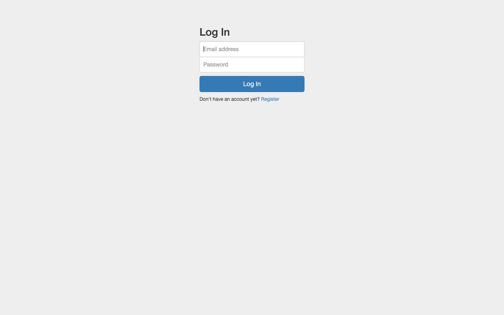
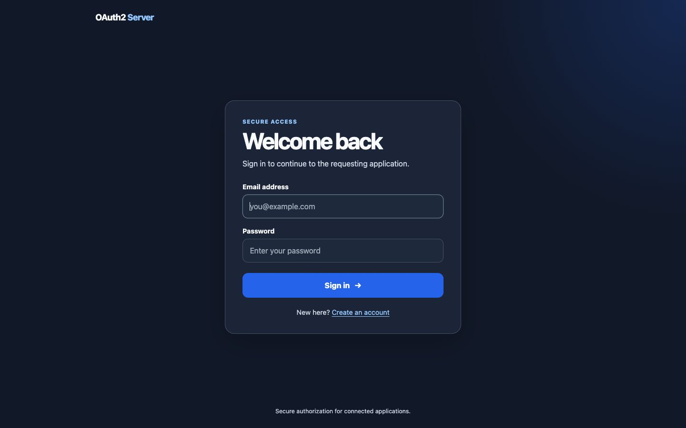
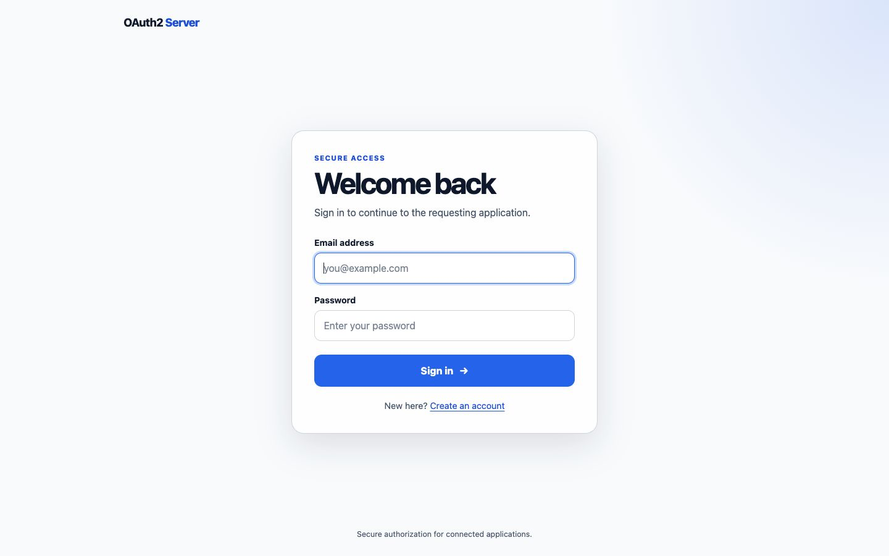
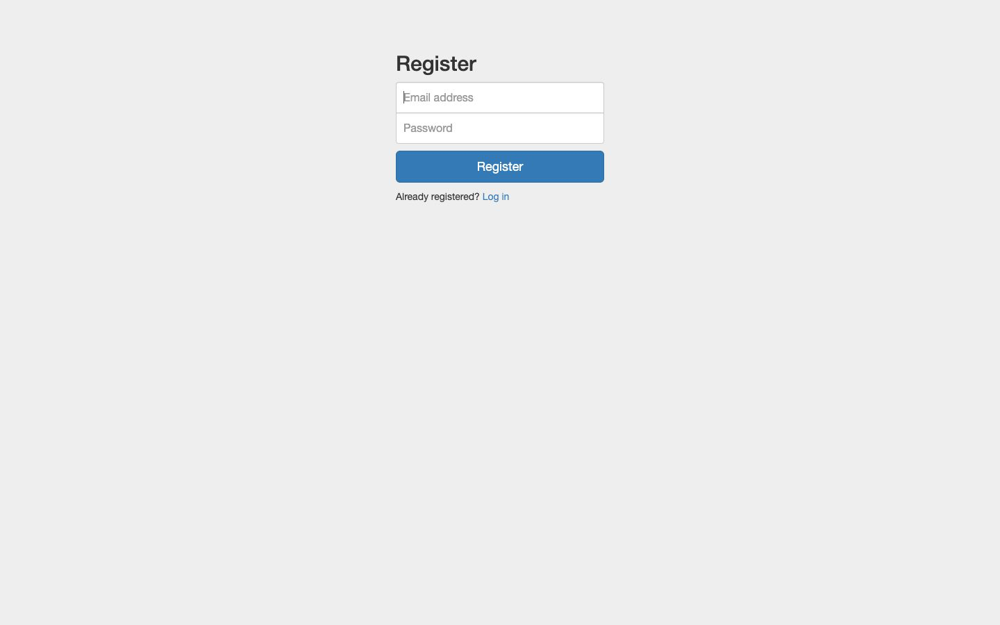
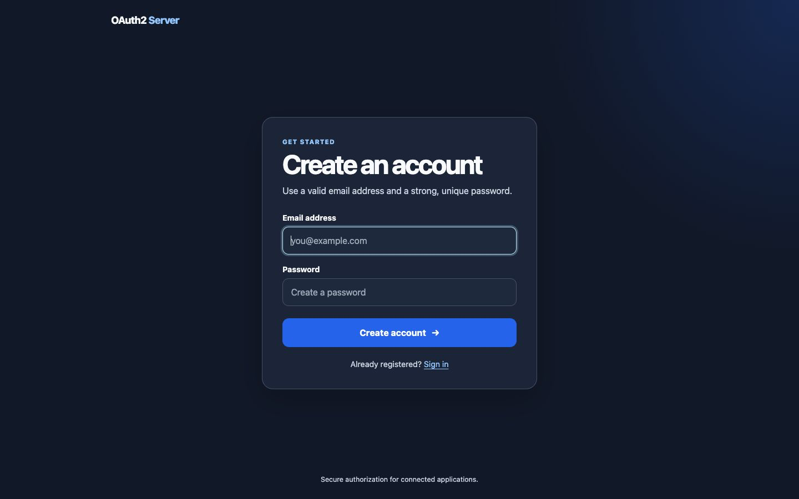
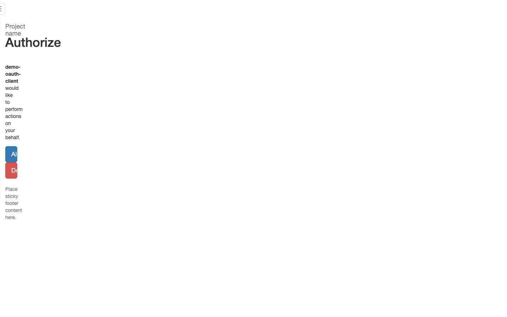
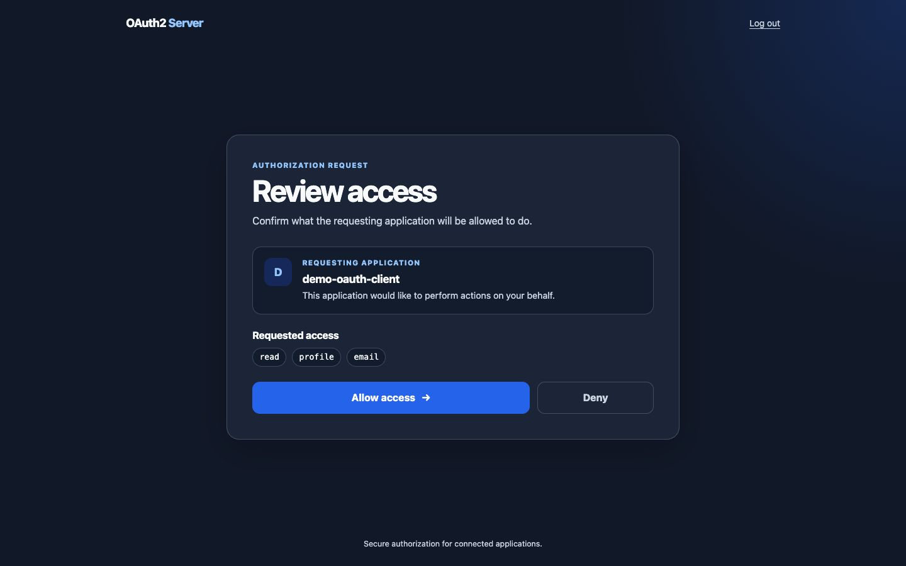
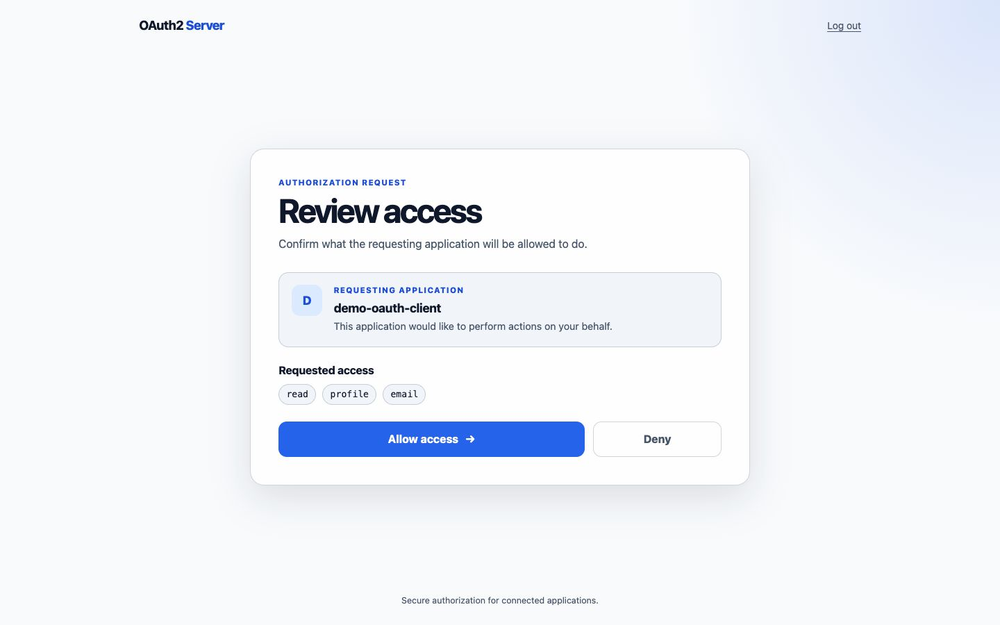

# Auth UI refresh

Screenshots were captured at 1440 × 900 against the test-mode server with a
seeded OAuth client. The updated pages use the system color scheme; both light
and dark palettes are represented below.

## Login

| Before | After (dark) |
| --- | --- |
|  |  |

## Registration

| Before | After (dark) |
| --- | --- |
|  |  |

## Authorization consent

| Before | After (dark) |
| --- | --- |
|  |  |

